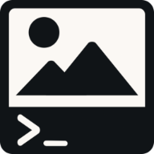

# -Good Project name-

<p align="center">
    
</p>

<p align="center">
    <em>An image editor. In the terminal. In the browser.</em>
</p>

## Project Structure

```text
codejam-laudatory-larkspurs/
├─ build.py                  # Build + serve script (Pyodide bundling)
├─ pyproject.toml            # Project & dependency metadata
├─ uv.lock                   # Locked dependency versions
├─ README.md / CONTRIBUTING.md
├─ LICENSE
├─ .pre-commit-config.yaml   # Lint & format hooks
├─ .github/workflows/
│   └─ lint.yaml             # CI lint pipeline
├─ public/                   # Static assets
│   ├─ index.html
│   ├─ favicon.* / icons
│   ├─ site.webmanifest
│   └─ templates/
│       └─ app_template.html
├─ samples/                  # Example environment files
│   └─ Pipfile
└─ src/                      # Application source (runs in Pyodide)
    ├─ main.py               # Entry point
    ├─ terminal.py           # Terminal UI
    ├─ image.py              # Image model
    ├─ commands/             # Individual terminal commands
    │   ├─ base_command.py
    │   ├─ background.py
    │   ├─ draw_circle.py
    │   ├─ draw_line.py
    │   ├─ draw_pixel.py
    │   ├─ draw_rectangle.py
    │   ├─ help.py
    │   ├─ image_info.py
    │   ├─ load_image.py
    │   ├─ ls.py
    │   ├─ ping.py
    │   ├─ save_image.py
    │   ├─ undo.py
    │   └─ __init__.py
    ├─ gui/                   # Lightweight GUI abstraction
    │   ├─ element.py
    │   ├─ layout.py
    │   ├─ components/
    │   │   ├─ description.py
    │   │   ├─ drag_drop_handler.py
    │   │   ├─ file_upload_handler.py
    │   │   ├─ image_display_manager.py
    │   │   ├─ image_preview.py
    │   │   ├─ separator.py
    │   │   ├─ terminal_gui.py
    │   │   ├─ terminal_input.py
    │   │   ├─ terminal_io.py
    │   │   └─ __init__.py
    │   └─ __init__.py
    ├─ images/
    │   └─ default.png
    └─ utils/
        ├─ color.py
        └─ __init__.py
```

## Setup

1. First we set up our python enviroment

```shell
python -m venv .venv
```

1. Entering it

```shell
# Linux, Bash
$ source .venv/bin/activate
# Linux, Fish
$ source .venv/bin/activate.fish
# Linux, Csh
$ source .venv/bin/activate.csh
# Linux, PowerShell Core
$ .venv/bin/Activate.ps1
# Windows, cmd.exe
> .venv\Scripts\activate.bat
# Windows, PowerShell
> .venv\Scripts\Activate.ps1
```

1. Installing development dependecies

```shell
pip install --group dev
```

_If it gives errors try:_

```shell
python -m pip install --upgrade pip  
```

1. If we want to exit our enviroment we do

```shell
deactivate
```

## Running the project

To build the project, run

```shell
python build.py --serve --port 8000
```

This will serve the project on `http://localhost:8000` after building it to `build/`. If you make changes to your code, run `build.py` again to rebuild the project.

## Contributors

[](https://github.com/Miras3210/codejam-laudatory-larkspurs/graphs/contributors)
