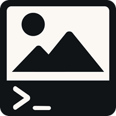

<!-- _coverpage.md -->

# Good Image Terminal <small>0.1.0</small>

> An image editor. In the terminal. In the browser.

- Built with **Pyodide**
- Supports basic image editing commands
- Easy to use with a simple command-line interface
- Runs in the browser

[Start Editing](https://good-image-terminal.vercel.app)
[Getting Started](#good-image-terminal)
