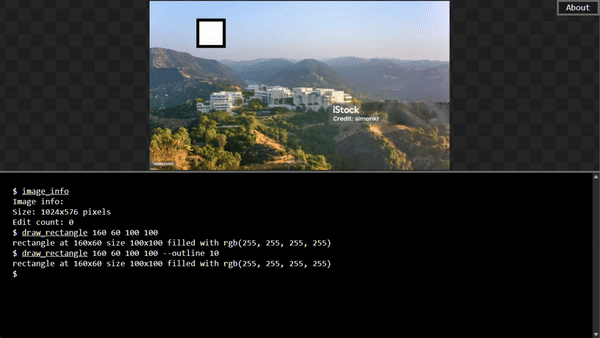
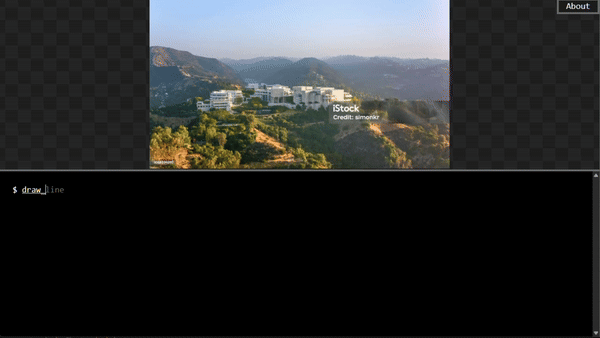
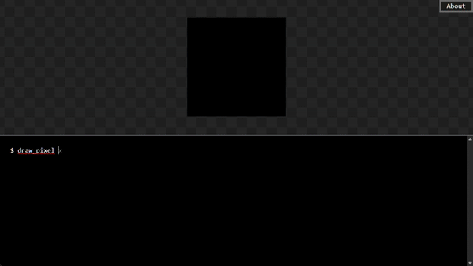
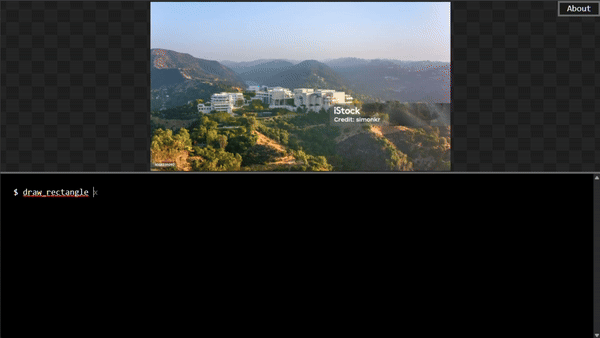
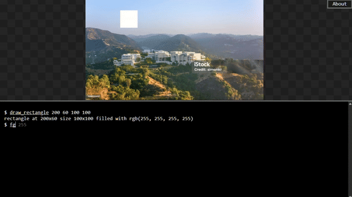

<!-- commands.md -->

# Commands

## `bg`

Sets the background color of the canvas. All subsequent drawing will be rendered on top of this background.

### Arguments

- `<color>`: The background color to set.

#### Color Argument

See [Color Formats](color_formats.md) for supported color syntaxes and examples.

### Usage: bg

```bash
bg <color>
```



## `draw_circle`

Draws a circle on the canvas at a specified position with customizable radius, colors, and outline thickness.

### Arguments

- `<x>`: The x-coordinate of the center of the circle.
- `<y>`: The y-coordinate of the center of the circle.
- `<radius>`: The radius of the circle.
- `--fg <color>`: The foreground color for the circle (optional).
- `--bg <color>`: The background color for the circle (optional).
- `--outline <int>`: The outline thickness (optional).
- `--no-fill`: If specified, the circle will not be filled.

#### Color Argument

See [Color Formats](color_formats.md) for supported color syntaxes and examples.

### Usage: draw_circle

```bash
draw_circle <x> <y> <radius> [--fg <color>] [--bg <color>] [--outline <int>] [--no-fill]
```



## `draw_line`

Draws a straight line between two points. The line color can be customized.

### Arguments

- `<x1>`: The x-coordinate of the start point.
- `<y1>`: The y-coordinate of the start point.
- `<x2>`: The x-coordinate of the end point.
- `<y2>`: The y-coordinate of the end point.
- `--fg <color>`: The foreground color for the line (optional).

#### Color Argument

See [Color Formats](color_formats.md) for supported color syntaxes and examples.

### Usage: draw_line

```bash
draw_line <x1> <y1> <x2> <y2> [--fg <color>]
```


## `draw_pixel`

Places a single pixel at the specified coordinates. The color can be defined with the foreground option.

### Arguments

- `<x>`: The x-coordinate of the pixel.
- `<y>`: The y-coordinate of the pixel.
- `--fg <color>`: The foreground color for the pixel (optional).

#### Color Argument

See [Color Formats](color_formats.md) for supported color syntaxes and examples.

### Usage: draw_pixel

```bash
draw_pixel <x> <y> [--fg <color>]
```



## `draw_polygon`

Draws a polygon using the provided vertices, with options for fill, outline, and colors.

### Arguments

- `<vertices>`: A list of points defining the polygon, e.g., `x1,y1 x2,y2 x3,y3 ...`.
- `--fg <color>`: The foreground color for the polygon (optional).
- `--bg <color>`: The background color for the polygon (optional).
- `--outline <int>`: The outline thickness (optional).
- `--no-fill`: If specified, the polygon will not be filled.

#### Color Argument

See [Color Formats](color_formats.md) for supported color syntaxes and examples.

### Usage: draw_polygon

```bash
draw_polygon <vertices> [--fg <color>] [--bg <color>] [--outline <int>] [--no-fill]
```


## `draw_rectangle`

Draws a rectangle on the canvas at the specified position and dimensions.

### Arguments

- `<x>`: The x-coordinate of the top-left corner.
- `<y>`: The y-coordinate of the top-left corner.
- `<width>`: The width of the rectangle.
- `<height>`: The height of the rectangle.
- `--fg <color>`: The foreground color for the rectangle (optional).
- `--bg <color>`: The background color for the rectangle (optional).
- `--outline <int>`: The outline thickness (optional).
- `--no-fill`: If specified, the rectangle will not be filled.

#### Color Argument

See [Color Formats](color_formats.md) for supported color syntaxes and examples.

### Usage: draw_rectangle

```bash
draw_rectangle <x> <y> <width> <height>
```



## `fg`

Sets the foreground color for use in drawing commands.

#### Arguments

- `<color>`: The color to set as the foreground color.

#### Color Argument

See [Color Formats](color_formats.md) for supported color syntaxes and examples.

### Usage: fg

```bash
fg <color>
```



## `help`

Displays information about available commands. When a specific command is given, it shows detailed usage instructions.

### Arguments

- `[command]`: The command to get help for (optional).
- `[page]`: The specific page of help to display (optional).

### Usage: help

```bash
help [command] [page]
```

## `image_info`

Displays details about the currently loaded image, such as dimensions and format.

### Usage: image_info

```bash
image_info
```

## `load_image`

Loads an image file into the canvas for editing or manipulation.

### Arguments

- `<filename>`: The name of the image file to load.

### Usage: load_image

```bash
load_image <filename>
```

## `ls`

Lists available files in the current working directory.

### Usage: ls

```bash
ls
```

## `ping`

Pong!

### Usage: ping

```bash
ping
```

## `save_image`

Saves the current canvas to an image file with the specified name.

### Usage: save_image

### Arguments

- `<filename>`: The name of the image file to save.

```bash
save_image <filename>
```

## `terminal_background`

Changes the background color of the terminal (not the canvas).

### Arguments

- `<color>`: The color to set as the terminal background.

### Color Argument

See [Color Formats](color_formats.md) for supported color syntaxes and examples.

### Usage: terminal_background

```bash
terminal_background <color>
```

## `undo`

Reverts the most recent drawing action on the canvas.

### Usage: undo

```bash
undo
```
